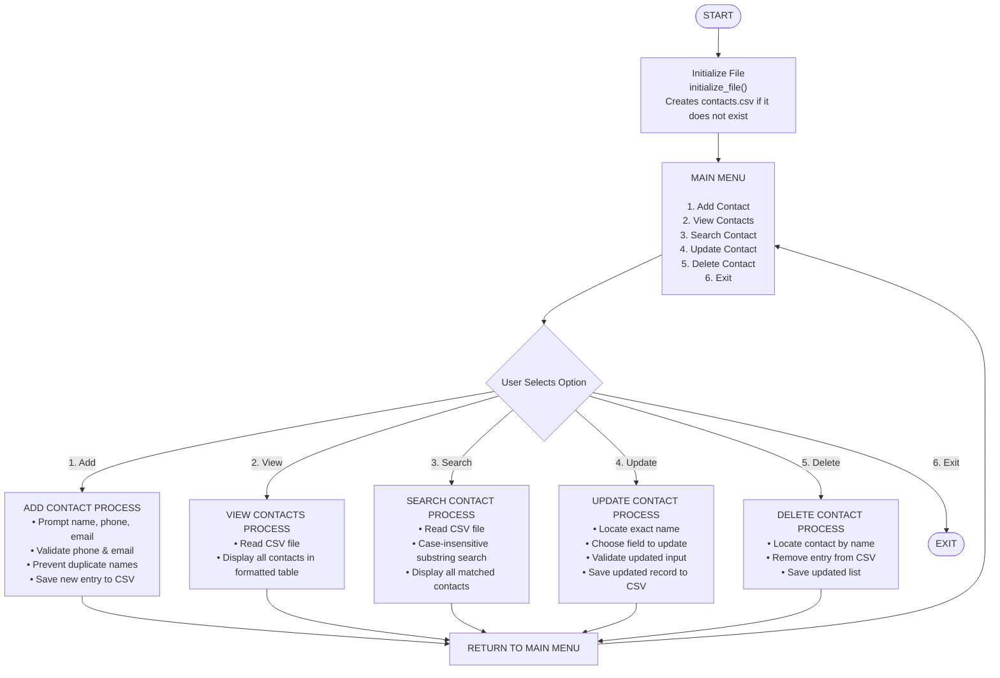

Contact Book Manager

Name: Aryan Kumar

Registration Number: 26BAI10710

Program: B.Tech CSE AI/ML

Institution: VIT Bhopal

Supervisor: Dr. M.K.Jayanthi

# Key Contents

- Introduction
- Features
- Installation
- Usage
- File Format
- Workflow & Flowchart
- Pseudocode
- Example session
- Notes & Tips

# Introduction

Contact Book Manager: A Simple Solution for Contact Organization
This is a straightforward, easy-to-use command-line application for keeping track of personal and work contacts. It's built around a simple, interactive menu that lets you perform all the key functions: add new people, see all your saved contacts, make updates to existing information, quickly search for someone, and remove records when you no longer need them.

### The Problem It Solves
The reason this tool was developed was to fix the mess of handling contacts the old way—scrawling names and numbers in a notebook, or saving them in random, scattered digital files. These traditional methods are unreliable, easily misplaced, difficult to keep tidy, and become disorganized fast. By using a basic CSV file (like a simple spreadsheet) and some core Python programming, this tool offers a dependable way to keep your contact data clean, easy to search, and perfectly consistent in its format.

### Programming Highlights
For anyone interested in the code, the project is a great showcase of fundamental programming skills. It clearly demonstrates essential concepts like reading from and writing to files (file handling), checking if data is entered correctly (data validation), building a program in organized, separate sections (modular design), and creating a good user experience right in the terminal. It proves that a simple Python script can handle a very practical real-world task effectively without needing any complex third-party libraries.

In short, the Contact Book Manager is a perfect starting project that provides a clear, practical way to manage contacts while teaching the basics of good Python programming

That's a great breakdown of the Contact Book Manager's features! Here is the revised, human-friendly version focusing on clarity and ease of understanding.

# Features
###  Contact Book Manager Features Explained
###  1. Adding a New Contact
This is where you create a new entry. You'll need to provide the name, phone number, and email address.

Smart Checks: The system runs a few checks to keep your data clean:

- It ensures the Name isn't left empty.
- It verifies the Phone Number contains only digits.
- It makes sure the Email address follows a standard, valid format.
- Crucially, it prevents duplicates by checking if a contact with that exact name already exists.
### 2. Viewing All Contacts
You can instantly see every contact you've saved.

All the data is presented in a neat, easy-to-read table with columns for Name, Phone, and Email.

This view pulls information directly from the stored data file, guaranteeing you see the most accurate, up-to-date list.

If you haven't added anyone yet, the program will clearly tell you so, instead of showing a blank screen.

### 3. Searching for a Contact
Need to find someone quickly? Just use the search function.

You can search using just part of a name.

The search is case-insensitive (it doesn't care about capitalization) and finds matches even if your input is only a substring of the contact's name. All matching contacts are then displayed with their full details.

### 4. Updating a Contact
This lets you edit or change an existing record.

First, you enter the exact name of the person you want to modify.

Once the contact is found, the program gives you options to change the name, phone number, or email address.

Note: Any fields you update are run through the same validation checks used when adding a new contact, so your data stays consistent and clean.

### 5. Deleting a Contact
If you need to remove an entry, this is the place.

Simply enter the name of the contact to be removed.

If the name is found, the entry is permanently deleted, and the main data file is updated.

If the name isn't found, you'll be notified immediately, preventing you from accidentally deleting the wrong person.

### Technical Details
### CSV-Based Data Storage
All your contact information is stored in a simple text file named contacts.csv.

The file uses a fixed structure with three headers: Name, Phone, and Email. This ensures the data is always organized consistently.

The system is set up to automatically create this file if it doesn't exist, making the initial setup seamless.

### Input Validation (Data Quality)
The project prioritizes data quality by checking user inputs:

- Phone numbers are checked to ensure they contain only numerical digits.
- Email addresses are checked using a simple rule-set (regular expression) to ensure they look like a standard, valid email.
# Installation

### Follow these steps to get the project running on your system.
### Install Python
Ensure Python 3.14 is installed.

### Download the project files
Place the following file in a folder:
contact_book.py (main script)

### Run the program
Open a terminal in the project folder and run:

```bash
python main.py
```

### Notes
No external libraries required — standard library only.

The program creates contacts .csv automatically if it’s missing.

# Usage

Start the program:

python main.py

### Main menu options:
1. Add Contact
2. View All Contacts
3. Search Contact
4. Update Contact
5. Delete Contact
6. Exit

### Typical flow:
Choose the option number.

Follow on-screen prompts for input.

Data is saved automatically to contacts.csv.

# File Format

### CSV Filename: contacts.csv
### Headers:
Name,Phone,Email

Each row represents one contact, stored in plain UTF-8 format. 
Example:  John Doe,9876543210,john@example.com

The file is created automatically if it doesn’t exist.

# Workflow & Flowchart



# Pseudocode

``` text
START
  initialize_file()  # create CSV if needed
  REPEAT
    DISPLAY menu
    INPUT choice
    IF choice == 1:
      add_contact()
    ELIF choice == 2:
      view_contacts()
    ELIF choice == 3:
      search_contact()
    ELIF choice == 4:
      update_contact()
    ELIF choice == 5:
      delete_contact()
    ELIF choice == 6:
      EXIT loop
    ELSE:
      print "Invalid choice"
  UNTIL choice == 6
END

```

# Example Session

=== CONTACT BOOK MANAGER ===
1. Add Contact
2. View All Contacts
3. Search Contact
4. Update Contact
5. Delete Contact
6. Exit

Enter your choice (1–6): 1

--------------------------------------
           ADD NEW CONTACT
--------------------------------------
Enter Name: Aryan Kumar
Enter Phone (digits only): 9876543210
Enter Email: aryan@example.com

Success: Contact 'Aryan Kumar' added!
=== CONTACT BOOK MANAGER ===
Enter your choice (1–6): 2

| NAME | PHONE | EMAIL |
|---|---|---|
| Aryan Kumar | 9876543210 | aryan@example.com |
=== CONTACT BOOK MANAGER ===
Enter your choice (1–6): 3
Enter name to search: Aryan

### Search Results:
Name: Aryan Kumar, Phone: 9876543210, Email: aryan@example.com
=== CONTACT BOOK MANAGER ===
Enter your choice (1–6): 6
Goodbye!

# Notes & Tips

Duplicate names are blocked (case-insensitive).

Phone validation currently accepts digits only. To allow + or hyphens, update is_valid_phone.

Email validation uses a simple regex; replace it for stricter RFC compliance.

Encoding: uses UTF-8. On Windows, switch to utf-8-sig if you need BOM.

Suggested improvements you can add later:

- Confirmation prompt for deletes
- Phone normalization (strip dashes/spaces)
- Logging instead of prints
- Unit tests for validators and file ops
- Migrate storage to SQLite for bigger datasets
